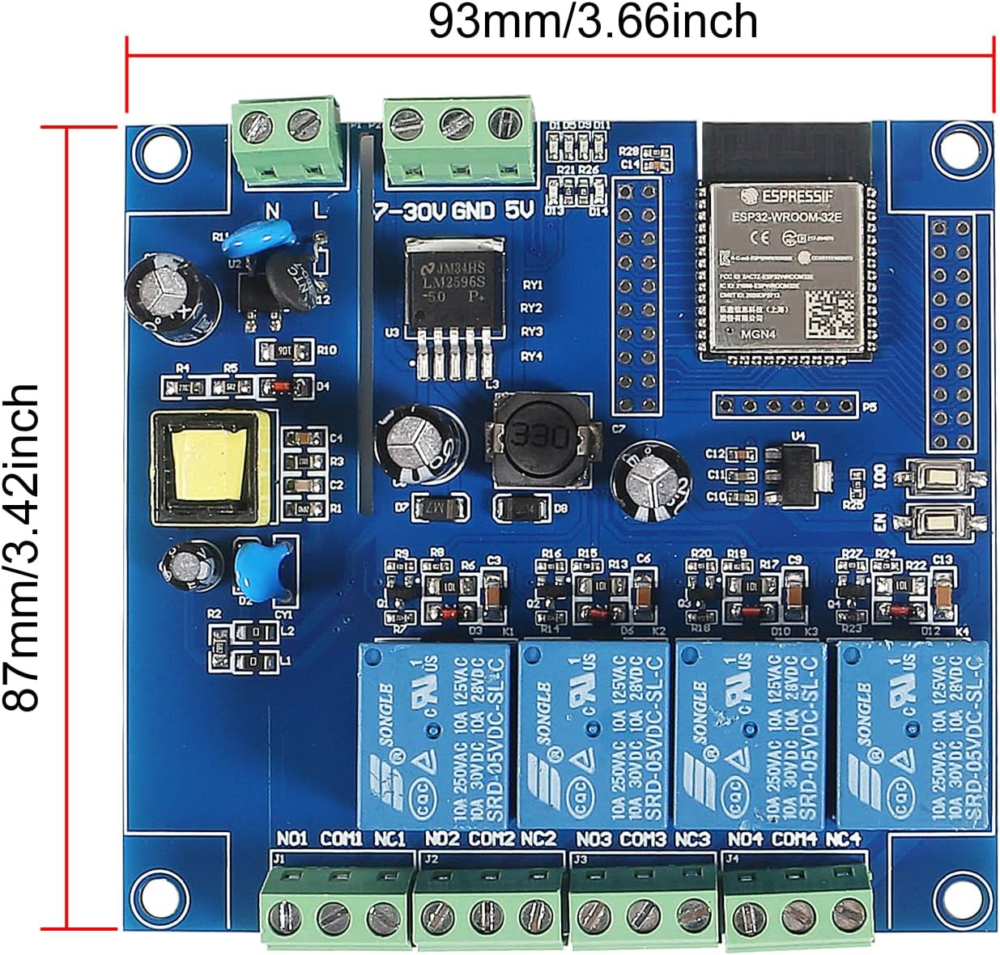

# ESP32 Wireless Thermostat

A two-unit wireless HVAC thermostat system built on ESP32. A **controller** board wired to your furnace manages relay outputs for heating, cooling, and fan. A **touchscreen display** mounted on the wall provides the user interface. The two units communicate wirelessly over ESP-NOW and coordinate through MQTT for Home Assistant integration.



## Features

- **Touchscreen UI** — 4.3" 800x480 capacitive display with home, fan, mode, and settings pages plus an idle screensaver
- **Wireless** — ESP-NOW for fast local command/telemetry between controller and display; no wiring between the two units
- **Home Assistant** — MQTT discovery automatically registers a climate entity with mode, fan, and target temperature controls
- **Safety first** — Failsafe timeout, relay interlocking, minimum run/off timers, HVAC lockout, and command sequence validation
- **OTA updates** — ArduinoOTA, web-based upload (`/update`), and automatic firmware rollback if connectivity isn't restored within 3 minutes
- **Weather display** — Outdoor temperature and conditions via PirateWeather API
- **Runtime configuration** — Web UI at `/config` and MQTT topics for WiFi, MQTT, ESP-NOW, display, and weather settings without reflashing
- **Filter tracking** — Accumulated fan runtime with reset capability
- **Temperature compensation** — Configurable offset for the indoor sensor
- **BLE WiFi provisioning** — Automatic fallback to Bluetooth provisioning if no stored WiFi credentials are found
- **Desktop simulators** — SDL2-based previews of both the controller and thermostat display for development without hardware

## Hardware

### Controller Unit

Installed near the furnace. Connects to HVAC wiring via relay outputs (heat, cool, fan, spare).

| Component | Link |
|---|---|
| ESP32 4-relay controller board | [Amazon](https://www.amazon.com/dp/B0DNYYXQ3X) |
| AC-to-DC power supply (furnace side) | [Amazon](https://www.amazon.com/dp/B08Q81Y8NM) |
| 3D-printable enclosure | [`enclosures/Furnace Controller Encolsure v20.f3d`](enclosures/Furnace%20Controller%20Encolsure%20v20.f3d) |

### Thermostat Display Unit

Wall-mounted touchscreen with built-in temperature/humidity sensor.

| Component | Link |
|---|---|
| ESP32-S3 4.3" capacitive touch display | [Amazon](https://www.amazon.com/dp/B0CLGCMWQ7) |
| AHT10/AHT20 temperature & humidity sensor | [Amazon](https://www.amazon.com/dp/B092495GZJ) |
| 3D-printable enclosure | [`enclosures/Thermostat Display v27.f3d`](enclosures/Thermostat%20Display%20v27.f3d) |

The sensor connects to the display board via I2C (SDA=GPIO 18, SCL=GPIO 17). See [`docs/hardware-requirements.md`](docs/hardware-requirements.md) for full GPIO pinouts and wiring details.

> **Enclosure note:** For fire safety compliance, print enclosures with a UL-listed filament such as Prusament PETG V0 or equivalent V0-rated material.

## Getting Started

### Prerequisites

- [PlatformIO](https://platformio.org/) (CLI or IDE plugin)
- An MQTT broker (e.g. Mosquitto) for Home Assistant integration
- 2.4 GHz WiFi network

### Build and Flash

```bash
# Controller firmware (ESP32)
pio run -e esp32-furnace-controller -t upload

# Thermostat display firmware (ESP32-S3)
pio run -e esp32-furnace-thermostat -t upload
```

Initial flash requires a USB connection. After that, OTA updates work over the network.

### Configuration

On first boot with no stored WiFi credentials, the thermostat display starts BLE provisioning. Use the ESP BLE Provisioning app to connect it to your network.

Once connected, configure both devices via their web UI:
- **Controller**: `http://<controller-ip>/config`
- **Display**: `http://<display-ip>/config`

Settings include WiFi, MQTT broker, ESP-NOW peer MAC and channel, temperature unit, display timeout, weather API key, and more. See [`docs/deployment-runbook.md`](docs/deployment-runbook.md) for the full configuration reference.

## MQTT & Home Assistant

Both units connect to an MQTT broker. The thermostat display publishes Home Assistant MQTT discovery messages, automatically creating a climate entity.

**Command topics** (under the controller's base topic):

| Topic | Values |
|---|---|
| `cmd/mode` | `off`, `heat`, `cool` |
| `cmd/fan_mode` | `auto`, `on`, `circulate` |
| `cmd/target_temp_c` | float (Celsius) |
| `cmd/lockout` | `0`, `1` |
| `cmd/filter_reset` | `1` |
| `cmd/sync` | `1` |

## Desktop Simulators

Both simulators run on your desktop for UI development and testing without hardware. They communicate over MQTT, so you can run them together with a local broker to test the full command/telemetry loop.

**Requirements:** SDL2 (`brew install sdl2 sdl2_ttf` on macOS) and optionally Mosquitto (`brew install mosquitto`).

```bash
# Thermostat display preview
pio run -e native-ui-preview && .pio/build/native-ui-preview/program

# Controller preview
pio run -e native-controller-preview && .pio/build/native-controller-preview/program
```

**Display simulator controls:**
| Key | Action |
|---|---|
| `W` | Cycle weather conditions |
| `[` / `]` | Adjust outdoor temperature |
| `S` | Activate screensaver |
| `D` | Wake display |

## Build Targets

| Environment | Description |
|---|---|
| `esp32-furnace-controller` | Controller firmware for ESP32 |
| `esp32-furnace-thermostat` | Display firmware for ESP32-S3 |
| `native-tests` | 37 unit tests (run with `.pio/build/native-tests/program`) |
| `native-ui-preview` | Desktop thermostat display simulator |
| `native-controller-preview` | Desktop controller simulator |

## Documentation

- [`docs/hardware-requirements.md`](docs/hardware-requirements.md) — GPIO pinouts, board specs, wiring
- [`docs/deployment-runbook.md`](docs/deployment-runbook.md) — Runtime configuration, MQTT topics, first-boot setup
- [`docs/system-spec-and-parity.md`](docs/system-spec-and-parity.md) — System specification and feature tracking
- [`docs/espnow-transport.md`](docs/espnow-transport.md) — ESP-NOW packet protocol details

## License

This project is provided as-is for personal and educational use. HVAC wiring involves line voltage — follow your local electrical codes and consult a qualified technician if needed.
